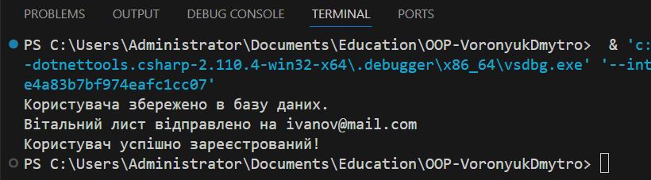

# Самостійна робота 16

## Опис
Цей проект демонструє використання принципу **Єдиної відповідальності (SRP)** для рефакторингу класу **UserManager**, що відповідає за реєстрацію користувача, валідацію пароля, збереження в базі даних та відправку вітального листа. Спочатку реалізовано "поганий" клас, який порушує SRP, після чого виконано рефакторинг на кілька окремих класів і інтерфейсів для дотримання SRP.

## Опис класів та інтерфейсів
1. **IUserValidator**: Інтерфейс для валідації пароля користувача.
2. **IUserRepository**: Інтерфейс для збереження користувача в базі даних.
3. **IPasswordHasher**: Інтерфейс для хешування пароля.
4. **IEmailService**: Інтерфейс для відправки вітальних листів.
5. **UserValidator**: Реалізація валідації пароля.
6. **UserRepository**: Реалізація збереження користувача в базі даних.
7. **PasswordHasher**: Реалізація хешування пароля.
8. **EmailService**: Реалізація відправки вітальних листів.
9. **UserService**: Клас для реєстрації користувача, який використовує всі інші класи для виконання завдання.

## Очікуваний результат
Після запуску програми ви побачите наступний вивід в консоль:

## Висновки
- Кожен клас виконує тільки одну відповідальність, що покращує підтримуваність та тестованість коду.
- Принцип **SRP** дозволяє легко змінювати та розширювати систему без ризику для інших частин коду.
- Використання інтерфейсів забезпечує гнучкість і спрощує заміну реалізацій.
