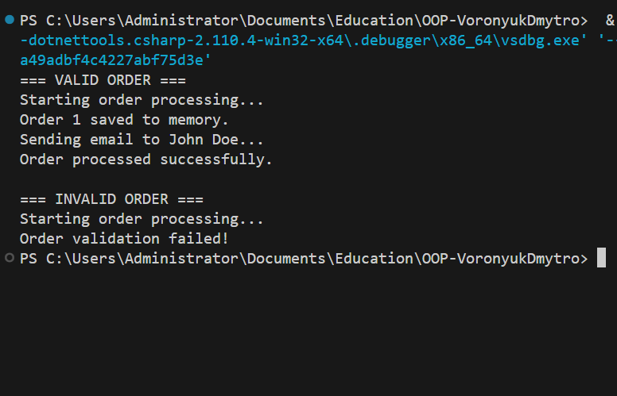

# Лабораторна робота №20  
## Тема: SRP. Декомпозиція OrderProcessor

### Мета роботи
Метою лабораторної роботи є закріплення принципу єдиної відповідальності (Single Responsibility Principle, SRP) на практиці шляхом декомпозиції складного класу OrderProcessor на менші, логічно розділені компоненти.

### Рефакторинг відповідно до SRP
Під час рефакторингу функціональність класу OrderProcessor була розділена на окремі інтерфейси та їх реалізації.  
Валідація замовлення винесена в окремий сервіс, збереження даних в репозиторій, а відправка повідомлень в email-сервіс.  
Клас OrderService відповідає лише за координацію цих компонентів і отримує всі залежності через конструктор, що відповідає принципу Dependency Injection.

### Демонстрація роботи
Для кожного сценарію виводяться повідомлення в консоль, які показують результат валідації, збереження та зміни статусу замовлення. У методі Main продемонстровано роботу програми для двох сценаріїв:
- валідне замовлення з коректною сумою;
- невалідне замовлення з некоректною сумою.

### Скріншот запуску програми

### Висновок
У результаті виконання лабораторної роботи було продемонстровано практичне застосування принципу єдиної відповідальності.  
Розділення логіки на окремі класи зробило код більш зрозумілим, гнучким та простим у підтримці. Кожен компонент тепер має чітко визначену відповідальність, що відповідає принципам чистої архітектури та SRP.
