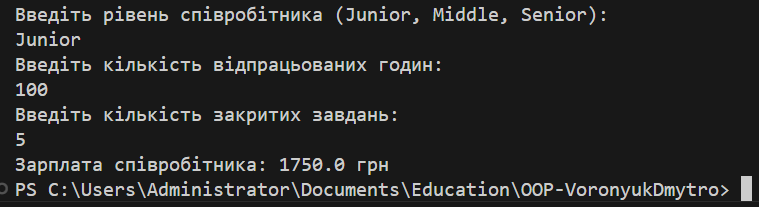

# EmployeeSalaryCalculator

Цей проєкт реалізує систему розрахунку зарплати співробітників різних рівнів (Junior, Middle, Senior) з використанням патернів **Factory Method** та **Strategy**. Програма обчислює зарплату на основі кількості відпрацьованих годин та кількості закритих завдань для кожного рівня співробітника.

## Опис

У проєкті реалізовано наступні стратегії для розрахунку зарплати:
- **Junior Developer**: Погодинна ставка 15 грн/год та бонус 50 грн за завдання.
- **Middle Developer**: Погодинна ставка 25 грн/год та бонус 100 грн за завдання.
- **Senior Developer**: Погодинна ставка 40 грн/год та бонус 150 грн за завдання.

Патерн **Strategy** дозволяє легко додавати нові стратегії для інших рівнів співробітників без змін в основному коді.

### Файли:

- **EmployeeSalaryStrategyFactory.cs**: Реалізація фабрики стратегій для створення відповідної стратегії на основі рівня співробітника.
- **IEmployeeSalaryStrategy.cs**: Інтерфейс для всіх стратегій, що визначає метод `CalculateSalary`.
- **JuniorDeveloper.cs, MiddleDeveloper.cs, SeniorDeveloper.cs**: Реалізації стратегій для різних рівнів співробітників.
- **SalaryCalculator.cs**: Клас для розрахунку зарплати.
- **Program.cs**: Основний файл програми, який отримує дані від користувача і виводить результат.

## Запуск

## Висновок
Виконано реалізацію системи для розрахунку зарплати співробітників різних рівнів (Junior, Middle, Senior) із застосуванням патернів **Factory Method** та **Strategy**. Користувач може вибрати рівень співробітника та отримати розрахунок зарплати, враховуючи кількість відпрацьованих годин та закритих завдань. Програма дозволяє легко додавати нові стратегії для інших рівнів співробітників без змін в основному коді, що демонструє принцип **відкритості/закритості (OCP)**.

