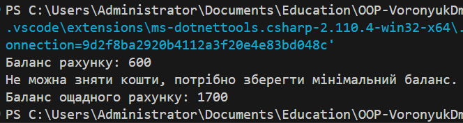

# Лабораторна робота 22: LSP (Банківські рахунки)

## Опис проєкту
Цей проєкт демонструє порушення принципу підстановки Лісков (LSP) в ієрархії класів для банківських рахунків, а також рішення цього порушення за допомогою композиції замість наслідування.

У проєкті реалізовано два варіанти:

1. **Початкова версія**: Використовує наслідування, що призводить до порушення LSP.
2. **Рефакторингова версія**: Використовує композицію для уникнення порушень принципу LSP.

### Принцип підстановки Лісков (LSP)
LSP є важливим принципом в об'єктно-орієнтованому програмуванні, який вимагає, щоб похідні класи могли заміняти базові класи без зміни очікуваної поведінки програми. Якщо похідний клас змінює поведінку так, що це порушує очікування програми, це є порушенням LSP.

## Запуск, демонстрація двох програм

1. Початкова версія:

2. Рефакторингова версія:

## Висновок

Принцип підстановки Лісков (LSP) є важливою частиною об'єктно-орієнтованого програмування, що забезпечує правильну заміну базових класів на похідні без зміни поведінки програми. Порушення цього принципу може призвести до непередбачуваної поведінки програми та помилок.

У цьому проєкті ми продемонстрували, як порушення LSP виникає через посилення передумов у похідному класі, що ускладнює використання класів у більш загальному контексті. Замість того, щоб застосовувати наслідування в похідному класі `SavingsAccount`, ми застосували композицію, що дозволяє уникнути порушення LSP, не змінюючи поведінку базового класу та забезпечуючи більш гнучку і масштабовану архітектуру.

Рефакторинг за допомогою композиції не тільки вирішує проблему LSP, але й робить код більш гнучким для подальших змін, зберігаючи високу підтримуваність і чистоту коду.

Застосування цього принципу підвищує надійність системи, дозволяючи використовувати класи в різних сценаріях без порушення їх передбачуваної поведінки.
