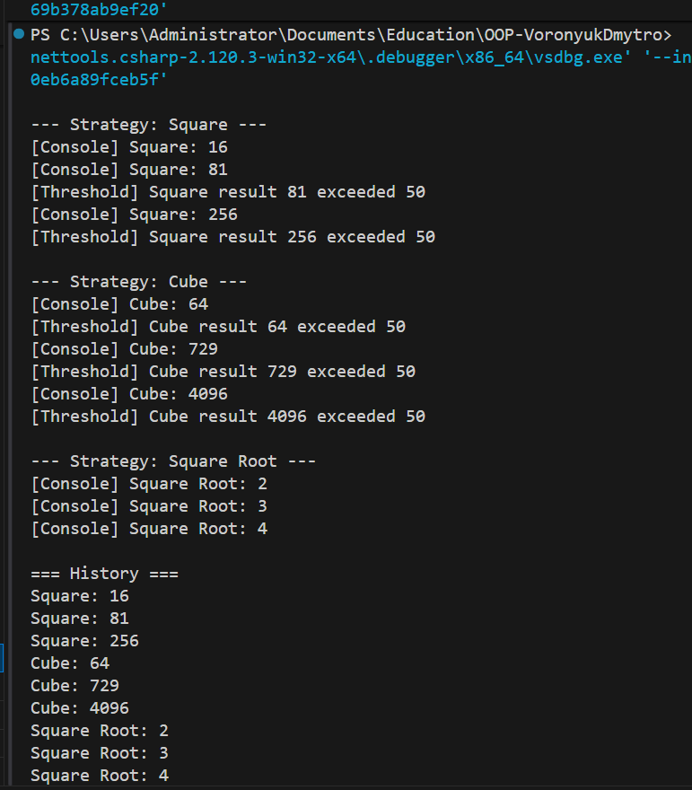

# Lab24: Strategy + Observer

## Опис

У даній лабораторній роботі реалізовано два поведінкові патерни проєктування: Strategy та Observer.
Метою роботи було створити гнучку систему обробки числових даних, у якій алгоритм обчислення можна змінювати під час виконання програми, а результати автоматично передаються зацікавленим компонентам.
Патерн Strategy дозволяє інкапсулювати різні алгоритми в окремі класи та взаємозамінно використовувати їх без зміни коду клієнта. Патерн Observer реалізує механізм підписки, за допомогою якого об'єкти-спостерігачі отримують сповіщення про події від об'єкта-джерела. Проєкт виконано у вигляді консольного застосунку мовою C#. Архітектура розділена на логічні модулі для кращої читабельності та підтримуваності коду.

---

## Структура проєкту

Strategy/
- INumericOperationStrategy
- SquareOperationStrategy
- CubeOperationStrategy
- SquareRootOperationStrategy
- NumericProcessor

Observer/
- ResultPublisher
- ConsoleLoggerObserver
- HistoryLoggerObserver
- ThresholdNotifierObserver

---

## Реалізація патерну Strategy

Інтерфейс визначає контракт для виконання числової операції. Кожна стратегія реалізує власний алгоритм обробки (квадрат, куб, квадратний корінь). Клас NumericProcessor виступає контекстом і делегує виконання поточній стратегії.

Під час виконання програми стратегія може змінюватися динамічно, що дозволяє використовувати один і той самий процесор для різних алгоритмів без створення нових класів або зміни існуючої логіки.

---

## Реалізація патерну Observer

ResultPublisher виступає джерелом подій. Після кожного обчислення результат передається всім підписникам.

Спостерігачі:
- Виводять результат у консоль.
- Зберігають історію виконаних операцій.
- Перевіряють перевищення порогового значення.

Такий підхід дозволяє відокремити логіку обчислення від логіки реагування на результат.

---

## Демонстрація роботи

У методі Main:

1. Створюється NumericProcessor із початковою стратегією.
2. Створюється ResultPublisher.
3. Ініціалізуються спостерігачі.
4. Спостерігачі підписуються на подію ResultCalculated.
5. Задається набір чисел для обробки.
6. Для кожної стратегії виконується обробка чисел.
7. Після кожного обчислення результат публікується та автоматично обробляється всіма підписниками.
8. Наприкінці виводиться історія результатів.

Таким чином демонструється динамічна зміна алгоритмів та одночасне сповіщення кількох незалежних компонентів.

---

## Тестування

Тестовий проєкт гарантує стабільність роботи системи та коректність реалізації патернів. Він перевіряє:
- правильність математичних обчислень;
- коректність зміни стратегії;
- виклик події ResultCalculated;
- реакцію спостерігачів.

---

## Результат

## Висновок

У ході виконання лабораторної роботи було практично реалізовано поведінкові патерни Strategy та Observer. Strategy забезпечує гнучкість та розширюваність системи, дозволяючи додавати нові алгоритми без модифікації існуючого коду. Observer забезпечує слабке зв’язування між компонентами та автоматичне реагування на зміни стану системи. Використання юніт-тестів підтверджує коректність реалізації та демонструє розуміння принципів побудови якісної архітектури програмного забезпечення. Комбінування цих патернів дозволяє будувати масштабовані, тестовані та підтримувані програмні рішення. 
