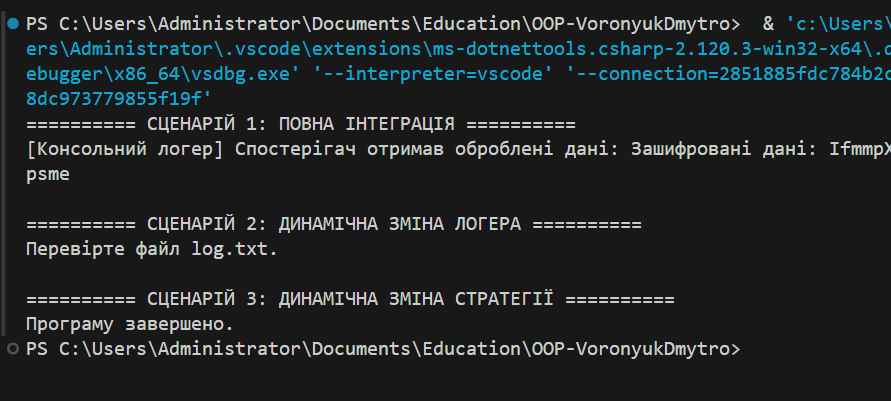

# Лабораторна робота №25  
## Інтеграція патернів проєктування: Factory Method, Singleton, Strategy та Observer.

---

## Мета роботи

Метою даної лабораторної роботи є розробка консольної системи, яка демонструє взаємодію між кількома патернами проєктування в межах єдиного програмного рішення. Основне завдання полягає не лише в окремій реалізації кожного патерна, а саме в перевірці їх коректної інтеграції та узгодженої роботи.
У процесі виконання роботи було реалізовано механізм обробки даних, який підтримує зміну алгоритму виконання під час роботи програми, можливість динамічної зміни способу логування, а також автоматичне сповіщення підписаних компонентів про завершення обробки даних.

---

## Опис реалізованої системи

Система побудована за принципом розділення відповідальностей. Обробка даних, логування та реакція на події ізольовані в окремі компоненти, що взаємодіють через визначені інтерфейси.
Центральною частиною є контекст обробки даних (`DataContext`), який використовує одну з реалізацій інтерфейсу `IDataProcessorStrategy`. Це дозволяє змінювати алгоритм обробки без модифікації клієнтського коду. Після завершення обробки результат передається об’єкту `DataPublisher`, який генерує подію. На цю подію підписаний спостерігач `ProcessingLoggerObserver`, що реагує на завершення процесу та виконує логування.
Логування організоване через фабричний механізм створення об’єктів. Клас `LoggerManager` реалізує патерн Singleton і забезпечує єдину точку доступу до фабрики логерів. Це дозволяє централізовано змінювати тип логування під час виконання програми.
Таким чином, у системі забезпечено слабке зв’язування компонентів і можливість їх незалежної модифікації.

---

## Реалізація патернів проєктування

### Factory Method

Патерн використовується для створення об’єктів логування без прямої залежності від конкретного класу. Реалізовано абстрактний клас `LoggerFactory`, а також його конкретні реалізації:

- `ConsoleLoggerFactory`
- `FileLoggerFactory`

Це дозволяє змінювати спосіб логування без зміни клієнтського коду.

---

### Singleton

Клас `LoggerManager` реалізовано як Singleton.  
Він гарантує:

- наявність лише одного екземпляра у системі;
- централізоване керування фабрикою логерів;
- контроль доступу до створення логерів.

Завдяки цьому логування в усіх частинах програми відбувається узгоджено.

---

### Strategy

Патерн Strategy використовується для реалізації змінної поведінки обробки даних.  
Передбачено дві стратегії:

- `EncryptDataStrategy`
- `CompressDataStrategy`

Контекст `DataContext` дозволяє змінювати стратегію під час виконання програми, що демонструє гнучкість архітектури.

---

### Observer

Патерн Observer реалізовано через подію `DataProcessed` у класі `DataPublisher`.  
Спостерігач `ProcessingLoggerObserver` підписується на цю подію та виконує логування після завершення обробки.
Логіка реагування на події винесена окремо від логіки обробки даних.

---

## Демонстраційні сценарії

Кожен сценарій відокремлений у консолі для зручності аналізу результатів. 
У програмі реалізовано три сценарії перевірки інтеграції:

1. Повна інтеграція всіх компонентів із використанням консольного логера та стратегії шифрування.
2. Динамічна зміна фабрики логування під час виконання.
3. Динамічна зміна алгоритму обробки даних.

---

## Результат роботи програми

---

## Висновок

У межах лабораторної роботи було реалізовано інтегровану систему, що поєднує чотири патерни проєктування в єдиній архітектурі. Робота продемонструвала можливість їх узгодженого використання та динамічної зміни поведінки системи під час виконання.
Застосування Factory Method та Singleton забезпечило централізоване керування створенням об’єктів. Strategy дозволив змінювати алгоритм обробки без втручання в клієнтський код, а Observer забезпечив автоматичну реакцію на події.  
Результат підтверджує коректну інтеграцію патернів і відповідність поставленим вимогам.
