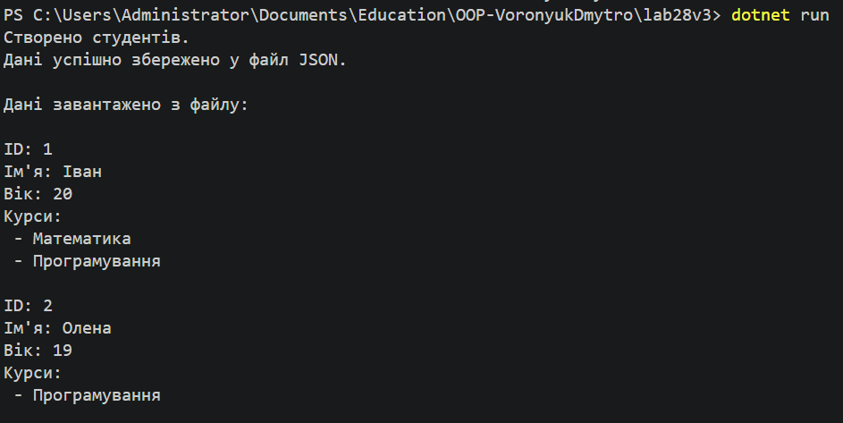

# Лабораторна робота №28

## Тема

Серіалізація об’єктів у JSON.

## Мета

Навчитися серіалізувати та десеріалізувати об’єкти у форматі JSON у середовищі .NET, а також зберігати та завантажувати дані з файлів за допомогою бібліотеки System.Text.Json.

## Опис роботи

У роботі було реалізовано просту систему для роботи зі студентами та їх курсами. Було створено класи Student та Course, які описують предметну область.

Клас Student містить інформацію про студента ідентифікатор, ім’я, вік та список курсів, на яких навчається студент. Клас Course описує курс та містить його ідентифікатор і назву.

Для роботи з даними було реалізовано клас StudentRepository, який виконує роль репозиторію. У цьому класі реалізовано методи для додавання студентів, отримання списку всіх студентів та пошуку студента за ідентифікатором.

Також у репозиторії реалізовано асинхронні методи SaveToFileAsync та LoadFromFileAsync, які дозволяють зберігати список студентів у JSON-файл та завантажувати дані з файлу назад у програму.

У програмі демонструється робота створених класів створюються кілька об’єктів студентів, додаються курси, після чого дані зберігаються у файл students.json. Далі дані завантажуються з цього файлу та виводяться у консоль.

## Результат роботи

## Висновок

У ході лабораторної роботи було вивчено принципи серіалізації та десеріалізації об’єктів у форматі JSON у середовищі .NET. Було створено класи предметної області та реалізовано репозиторій для роботи з даними. Також було реалізовано асинхронне збереження та завантаження даних у файл. Отримані знання дозволяють ефективно працювати зі структурованими даними та використовувати формат JSON для їх збереження і передачі між програмами.
