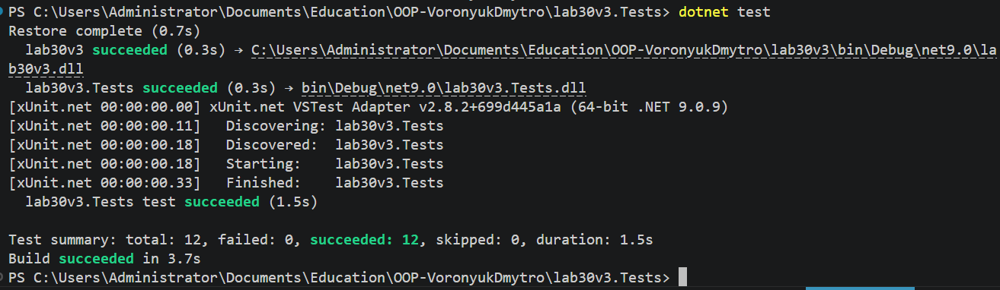

# Лабораторна робота №30

## Тема

Написання юніт-тестів з xUnit.

## Мета

Навчитися створювати юніт-тести для власного коду за допомогою фреймворку **xUnit**, використовувати різні типи перевірок (assertions) та параметризовані тести.

## Опис роботи

У роботі було реалізовано клас **DateHelper**, який містить методи для роботи з датами: визначення вихідного дня, обчислення кількості днів між двома датами та додавання робочих днів із пропуском вихідних.

Для перевірки коректності роботи класу було створено тестовий проєкт з використанням фреймворку **xUnit**. Юніт-тести дозволяють перевіряти роботу методів без необхідності запускати програму вручну.

У тестах використовувались атрибути **Fact** для перевірки окремих сценаріїв та **Theory** для параметризованих тестів із різними наборами вхідних даних. Було протестовано різні варіанти роботи методів, включаючи стандартні сценарії, різні комбінації параметрів та крайні випадки.

Загалом було написано **10 юніт-тестів**, які перевіряють роботу всіх методів класу **DateHelper**, а також обробку різних варіантів вхідних даних.

## Результат роботи

## Висновок

У ході лабораторної роботи було вивчено принципи написання юніт-тестів у середовищі .NET за допомогою фреймворку **xUnit**. Було реалізовано клас **DateHelper** та створено набір тестів для перевірки коректності його методів. Використання атрибутів **Fact** та **Theory** дозволило протестувати як окремі випадки, так і параметризовані сценарії. Юніт-тестування допомагає підвищити надійність коду, швидше знаходити помилки та забезпечує стабільність роботи програмного забезпечення.
