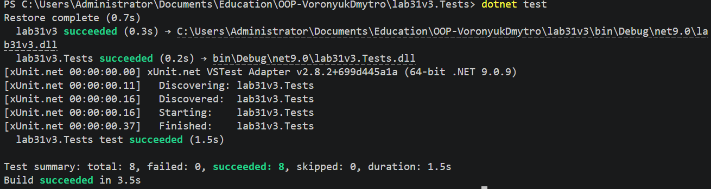

# Лабораторна робота №31

## Тема
Тестування з Moq (мокінг залежностей).

## Мета
Навчитися створювати mock‑об’єкти за допомогою бібліотеки Moq для тестування класів,
які мають залежності, а також використовувати методи Setup та Verify.

## Опис роботи
У роботі було створено сервіс PaymentService, який залежить від двох інтерфейсів:
IPaymentGateway та ITransactionLogger. Залежності передаються через конструктор
(Dependency Injection).

Для тестування сервісу було створено тестовий проєкт з використанням бібліотеки Moq.
Mock‑об’єкти дозволили імітувати роботу зовнішніх залежностей без реальної реалізації.
У тестах використовувались методи Setup для налаштування поведінки mock‑об’єктів
та Verify для перевірки викликів методів.

Було написано 8 юніт‑тестів, які перевіряють різні сценарії роботи сервісу:
успішний платіж, помилку платежу, некоректну суму, а також виклики логування
та платіжного шлюзу.

## Результат роботи

## Висновок
У ході виконання лабораторної роботи було освоєно використання бібліотеки Moq для
створення mock‑об’єктів і тестування класів із залежностями. Було реалізовано сервіс
з використанням Dependency Injection та написано набір юніт‑тестів для перевірки
його роботи. Використання Setup дозволило задати поведінку залежностей,
а Verify — перевірити правильність викликів методів. Отримані навички дозволяють
ефективніше тестувати програмні компоненти, ізолюючи їх від зовнішніх систем.