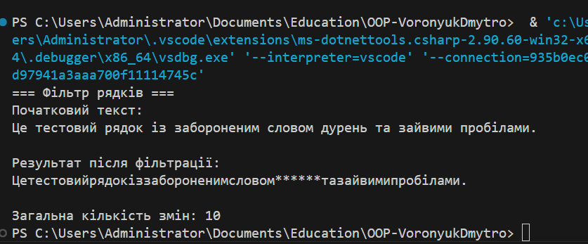

# Лабораторна робота №4
Тема: Абстракції та інтерфейси. Композиція та агрегація.

Мета: Навчитися створювати абстрактні класи та інтерфейси, будувати ієрархії класів із використанням композиції та агрегації, демонструвати повторне використання коду.

## Виконання завдання
Було реалізовано програму **«Фільтр рядків»**, яка підраховує кількість змін після застосування всіх фільтрів та складається з таких частин:

1. **Інтерфейс `ITextFilter`** — визначає методи `Apply()` та `GetChangesCount()`.
2. **Абстрактний клас `TextFilterBase`** — базова реалізація із збереженням кількості змін.
3. **Реалізації інтерфейсу:**
   - `SpaceRemoverFilter` — видаляє пробіли;
   - `BannedWordsFilter` — замінює заборонені слова на символи `*`.
4. **Клас `TextProcessor`** — об’єднує кілька фільтрів через **композицію**.
5. **Агрегація** — у `BannedWordsFilter` використовується список заборонених слів.

---

## Запуск програми

## Контрольні запитання

1. **У чому різниця між абстрактним класом і інтерфейсом?**  
   Абстрактний клас може містити реалізовані методи та поля, а інтерфейс лише сигнатури методів. Клас може наслідувати лише один абстрактний клас, але реалізовувати кілька інтерфейсів.

2. **Коли краще використовувати композицію, а коли наслідування?**  
   Наслідування використовують, коли новий клас є спеціалізацією існуючого. Композицію - коли потрібно використовувати функціональність іншого класу без створення жорсткої залежності.

3. **Як працює агрегація та чим вона відрізняється від композиції?**  
   Агрегація - об’єкти можуть існувати окремо. Композиція - коли об’єкти створюються та знищуються разом.

4. **Чи може клас реалізовувати кілька інтерфейсів одночасно?**  
   Так, у C# клас може реалізовувати довільну кількість інтерфейсів.

5. **Для чого в ООП використовують інтерфейси як контракти?**  
   Інтерфейси визначають набір методів, які клас зобов’язаний реалізувати, що забезпечує узгодженість і гнучкість системи.
