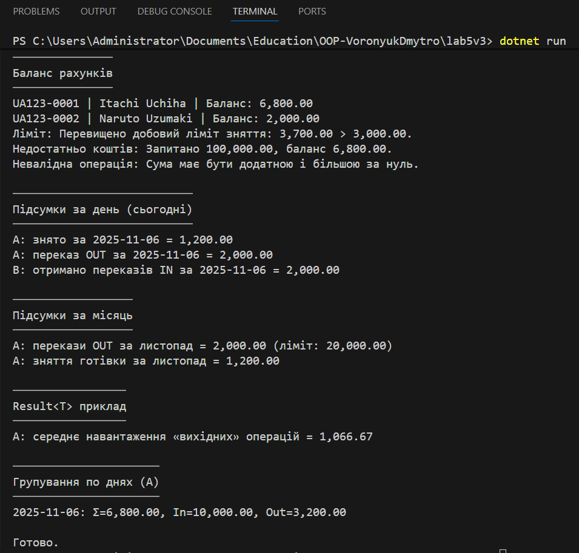

# Lab5v3 | Банківські рахунки 

**Тема:** Узагальнені типи (Generics), колекції і LINQ, обробка винятків.  
**Мета:** продемонструвати композицію `Account -> List<Transaction>`, узагальнений контейнер `Result<T>`, 
обчислення LINQ (баланс, денні/місячні підсумки), валідацію та власні винятки.

## Що реалізовано

- **Композиція:** `Account` містить `List<Transaction>`.
- **Generics:** `Result<T>` - універсальний контейнер для повернення успішного/помилкового результату.
- **Колекції + LINQ:** використано `Where`, `Sum`, `Average`, `GroupBy` для агрегатних обчислень (баланс, денні/місячні підсумки).
- **Валідація + винятки:**
  - `InvalidTransactionException` - недопустима сума.
  - `LimitExceededException` - перевищення добових/місячних лімітів.
  - `InsufficientFundsException` - зняття або переказ понад баланс.
- **Demo у `Program.cs`:** демонструються успішні операції, обробка винятків `try-catch`, вивід балансів та підсумків.

---

## Запуск

## Контрольні запитання

1. **Що таке generics? Які їхні переваги?**  
   Узагальнені типи дозволяють створювати класи і методи, що працюють з різними типами без втрати безпеки.  
   Переваги: **типобезпека**, **зменшення дублювання коду**, **краща продуктивність**, **гнучкість**.

2. **Основні відмінності між ArrayList і List<T>?**  
   `ArrayList` зберігає об’єкти типу `object`, вимагає перетворень типів.  
   `List<T>` - типобезпечний, швидший і не викликає boxing/unboxing.

3. **Чим відрізняється Dictionary<TKey,TValue> від List<T>?**  
   `Dictionary` - колекція пар ключ–значення з доступом за ключем `O(1)`.  
   `List` - послідовний список, пошук виконується за перебором `O(n)`.

4. **Перевага LINQ над класичними циклами?**  
   LINQ забезпечує декларативний, короткий та зрозумілий синтаксис для роботи з колекціями, дозволяє зручно комбінувати фільтрацію, сортування, групування.

5. **Як працює ключове слово finally?**  
   Блок `finally` виконується **завжди** після `try`/`catch`, навіть при винятках.  
   Використовується для звільнення ресурсів або закриття потоків.

6. **Коли доцільно створювати власні класи винятків?**  
   Коли стандартні винятки не описують сутність помилки предметної області.  
   Наприклад: **перевищення ліміту**, **недостатньо коштів**, **некоректна транзакція**.

---

## Висновок

У цій лабораторній роботі реалізовано повноцінну модель банківських рахунків. Програма продемонструвала практичне використання Generics, LINQ і Exception Handling в контексті реальної предметної області - банківської системи. В ній використовувались:
- **композиції (Account–Transaction)**;
- **узагальненого контейнера Result<T>**;
- **LINQ-операцій для аналізу колекцій**;
- **власних винятків для доменної логіки**.  

---
