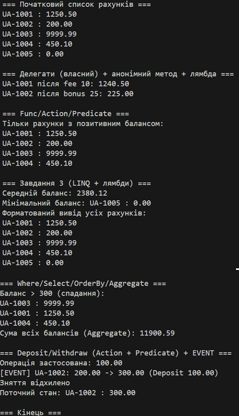

# Lab6: Lambda & Delegates

## Тема
Лямбда-вирази, анонімні функції та делегати у C#.

## Мета
- Закріпити знання про делегати та події.
- Навчитись використовувати анонімні методи, лямбда-вирази і вбудовані делегати (Func<>, Action<>, Predicate<>).
- Отримати практичний досвід застосування лямбда-виразів у колекціях і LINQ-операціях.

## Результат

