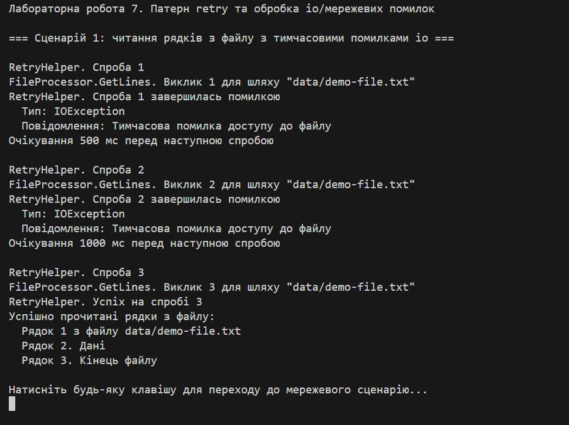
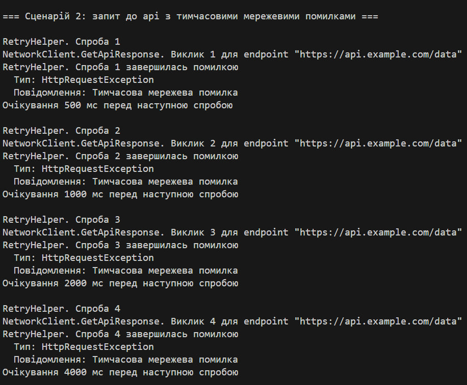
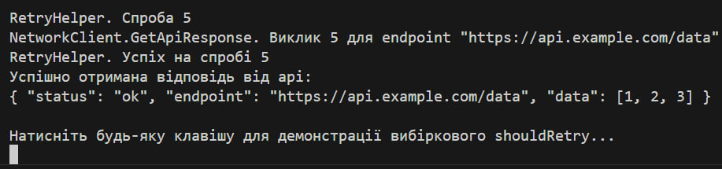
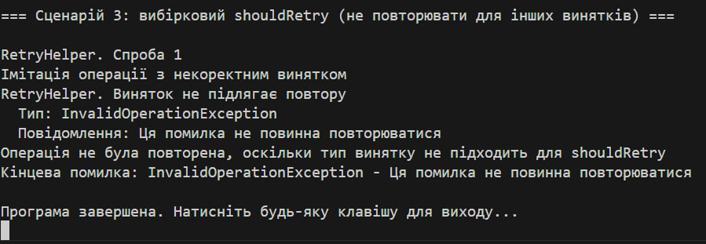

# Лабораторна робота №7

## Тема  
Обробка io/мережевих помилок та патерн retry

## Мета роботи  
Навчитися обробляти типові помилки вводу/виводу та мережеві винятки за допомогою блоків try-catch-finally, а також реалізувати патерн retry з експоненціальною затримкою для підвищення надійності застосунків.

---

## Хід роботи

### 1. Реалізація класів  
- Клас `FileProcessor` імітує роботу з файлами і перші дві спроби кидає `IOException`, після чого повертає коректні дані  
- Клас `NetworkClient` імітує мережевий запит і перші чотири спроби кидає `HttpRequestException`, після чого повертає успішну відповідь  
- Клас `RetryHelper` виконує повторні спроби, застосовуючи експоненційну затримку та вибіркове повторення через делегат `shouldRetry`

### 2. Демонстрація роботи  
У методі `Main` продемонстровано три сценарії:
1. обробка помилок io при читанні файлу  
2. обробка мережевих помилок api-запиту  
3. вибірковий retry для певних типів винятків  

---

## Результат роботи  

---

## Контрольні питання та відповіді

### 1. Які винятки найчастіше виникають при роботі з файлами та мережею?  
При роботі з файлами найчастіше виникають:  
- fileNotFoundException  
- directoryNotFoundException  
- ioException  

При роботі з мережею часто зустрічаються:  
- httpRequestException  
- socketException  

### 2. Що таке патерн retry і коли його слід застосовувати?  
Патерн retry полягає у повторному виконанні операції після помилки, якщо вона може бути тимчасовою.  
Використовується у випадках:  
- короткочасної недоступності сервісу  
- мережевих збоїв  
- тимчасового блокування файлу  

### 3. Як працює експоненціальна затримка між повторними спробами?  
Час очікування збільшується за формулою:  
`initialDelay * 2^(attempt - 1)`  
Це дозволяє зменшити навантаження на систему та дає можливість сервісу відновитися.

### 4. Для чого потрібен делегат shouldRetry у класі RetryHelper?  
Делегат дозволяє визначити, які винятки вважаються тимчасовими і підлягають повторенню.  
Наприклад, можна повторювати тільки `IOException` та `HttpRequestException`, ігноруючи інші помилки.

---

## Висновки  
У лабораторній роботі реалізовано механізм повторних спроб виконання операцій, що дозволяє підвищити стабільність застосунку при виникненні тимчасових помилок. Продемонстровано обробку файлових і мережевих винятків та застосовано експоненційну затримку разом із вибірковою логікою shouldRetry.

---
