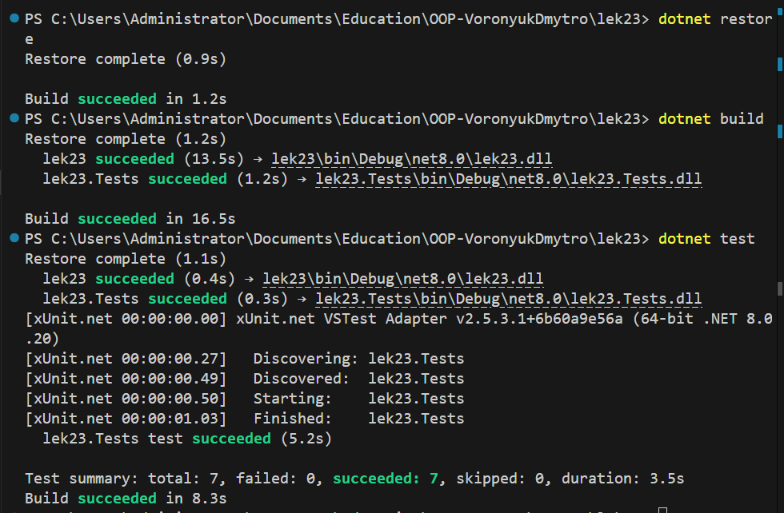

# Юніт-тестування: принципи, фреймворки, mock-об’єкти.

## Опис реалізованого проєкту (загальна інформація)

У межах лекції 23 було реалізовано навчальний проєкт **OrderManagement**, який демонструє практичне застосування юніт-тестування з використанням фреймворку xUnit та бібліотеки Moq.

Проєкт складається з двох частин:

* `lek23` - бібліотека з бізнес-логікою
* `lek23.Tests` - тестовий проєкт

Основна логіка зосереджена в сервісі `OrderService`, який:

* розраховує знижку
* створює замовлення
* отримує замовлення за ID
* перевіряє граничні значення
* генерує винятки при некоректних даних

---

## Архітектурні особливості

* використання інтерфейсу `IOrderRepository`
* ін’єкція залежності через конструктор
* ізоляція бізнес-логіки
* застосування mock-об’єктів
* перевірка викликів через Verify

---

# Результат



## Контрольні питання

### 1. Що таке юніт-тест і навіщо він потрібен?

Юніт-тест - це автоматизований тест, який перевіряє окрему одиницю коду (метод або клас) ізольовано від інших частин системи.  
Основна мета - швидке виявлення помилок під час розробки, забезпечення стабільності коду та можливість безпечного рефакторингу.

### 2. Пояснення Arrange-Act-Assert (AAA)

Arrange - підготовка даних і об’єктів.  
Act - виконання тестованого методу.  
Assert - перевірка отриманого результату.

### 3. Різниця між [Fact] та [Theory]

[Fact] використовується для тестів без параметрів.  
[Theory] дозволяє запускати тест з різними наборами даних через InlineData.

### 4. Навіщо потрібні mock-об’єкти?

Mock-об’єкти ізолюють тест від зовнішніх залежностей (БД, API). Вони дозволяють контролювати поведінку залежності та перевіряти, чи був викликаний певний метод.

### 5. Як перевірити кількість викликів методу?

За допомогою методу Verify бібліотеки Moq:
mock.Verify(r => r.Save(order), Times.Once);

### 6. Принципи FIRST

Тести повинні бути:
Fast, Independent, Repeatable, Self-Validating, Timely.

---

# Есе: «Юніт-тестування»

Юніт-тестування є невід’ємною частиною сучасної розробки програмного забезпечення. Воно базується на ідеї перевірки окремих компонентів системи ізольовано від інших частин. Такий підхід дозволяє зосередитися на логіці конкретного методу або класу, не враховуючи складну взаємодію з іншими модулями.

На практиці юніт-тести забезпечують швидкий зворотний зв’язок. Після внесення змін розробник може одразу запустити тестовий набір і переконатися, що новий код не зламав існуючу функціональність. Це особливо важливо під час рефакторингу або розширення системи. Якщо тести написані якісно, вони виступають своєрідною гарантією стабільності.

Порівняно з інтеграційним тестуванням, юніт-тести виконуються значно швидше та простіше в налаштуванні. Вони не потребують реальної бази даних чи зовнішніх сервісів. Інтеграційні тести, у свою чергу, перевіряють взаємодію між компонентами, але є повільнішими та складнішими в підтримці. Тому обидва підходи доповнюють один одного: юніт-тести відповідають за перевірку логіки, інтеграційні - за коректність взаємодії.

Важливою частиною практики є використання mock-об’єктів. Вони дозволяють ізолювати тест від зовнішніх залежностей і контролювати їхню поведінку. Це дає можливість перевірити не лише результат роботи методу, а й факт виклику певної залежності з конкретними аргументами.

Водночас юніт-тестування має обмеження. Воно не гарантує, що система працює коректно в цілому. Навіть якщо всі окремі модулі протестовані, можуть виникати помилки при їх інтеграції. Крім того, написання тестів потребує додаткового часу, що іноді сприймається як ускладнення процесу розробки. Проте в довгостроковій перспективі витрати часу окуповуються завдяки зменшенню кількості критичних помилок.

Юніт-тестування є базовим інструментом забезпечення якості програмного забезпечення. Воно підвищує надійність коду, покращує його структуру та сприяє дисциплінованому підходу до розробки.

---

# Приклад класу та тестів

```
public class Calculator
{
    public int Add(int a, int b) => a + b;

    public int Divide(int a, int b)
    {
        if (b == 0)
            throw new ArgumentException("Division by zero");
        return a / b;
    }
}
```

Тести:

```
Add_Success_ReturnsSum  
Add_ZeroValues_ReturnsZero  

Divide_ValidNumbers_ReturnsQuotient  
Divide_ByZero_ThrowsException  
```